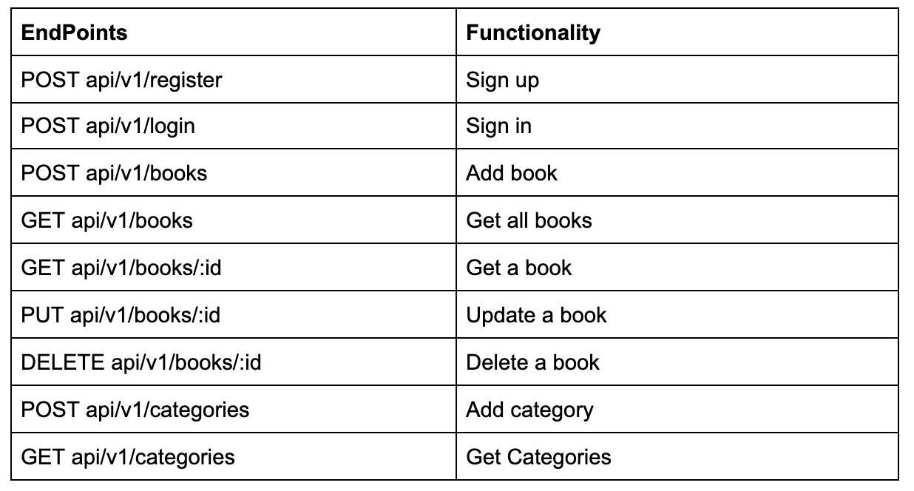
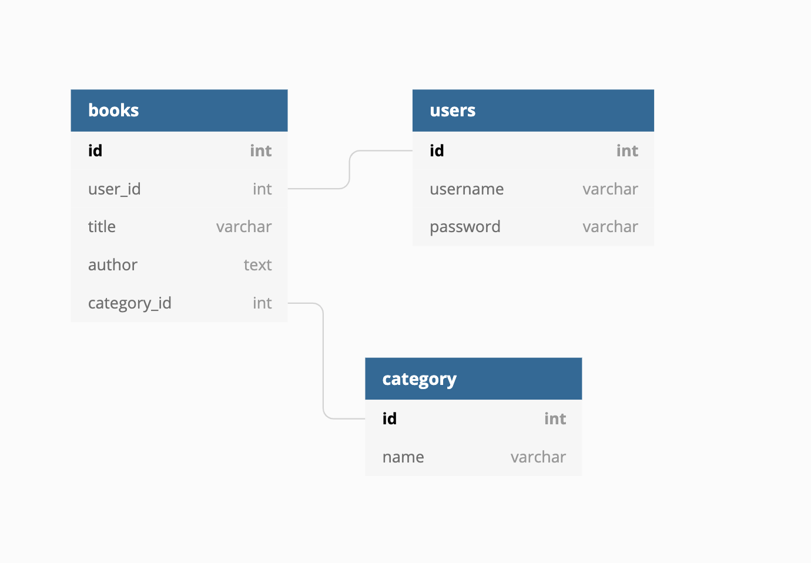

# Desarrollo dirigido por pruebas de una API RESTful JSON con Rails

> This is a personal translation of the following article: [_Test Driven Development of a RESTful JSON API With Rails_](https://www.microverse.org/blog/test-driven-development-of-restful-json-api-with-rails) for [__Uduak Essien__
](https://www.microverse.org/blog-authors/uduak-essien)

---
Para generar un _framework_ centrado en API, hace posible excluir funcionalidades que de otro modo no se usarían o serían innecesarias. El uso del flag `--api` hará:

* Iniciará la aplicación con un conjunto limitado de middleware
* Hará que `ApplicationController` herede de `ActionController::API` en lugar de `ActionController::Base`
* Omitir la generación de archivos de vista

En este artículo/tutorial de tres partes, crearemos una API de librería donde los usuarios pueden administrar sus listas de libros favoritos.

---
## Endpoints de la API
Nuestra API expondrá los siguientes puntos finales RESTful:  
  

### Diagrama de Entidad-Relación

El diagrama muestra un diseño simple de nuestra base de datos.
  

En este artículo cubriremos:
* __Configuración del proyecto__
* __API de Categoría__
* __API de libros__

---
## Configuración del proyecto 
Generemos rápidamente un nuevo proyecto _books-api_
```sh
rails new books-api --api -T -d postgresql
```

>__Nota:__ el flag `--api` le dice a Rails que queremos crear una aplicación solo para API. Usar `-d` nos permite especificar el tipo de base de datos que deseamos usar y `-T` omite el framework de prueba predeterminado (_Minitest_). No se preocupe, usaremos _RSpec_ en su lugar para probar nuestra API.

### Dependencias de gemas
Necesitaremos las siguientes gemas en nuestro _Gemfile_ para ayudar en nuestro proceso de desarrollo:
- `rspec-rails`: un framework de prueba para Rails 5.0+.
- `factory_bot_rails`: proporciona integración entre `factory_bot` y Rails 5.0+.
- `shoulda-matchers`: proporciona frases _RSpec_ de una sola línea para probar la funcionalidad común de Rails que, si se escribiera a mano, sería mucho más larga, más compleja y propensa a errores.
- `database_cleaner`: estrategias para limpiar bases de datos, se puede usar para garantizar una pizarra limpia para las pruebas.
- `faker`: se utiliza para generar fácilmente datos falsos: nombres, direcciones, números de teléfono, etc.

Ahora que tiene una mejor comprensión de las gemas que usaremos, configurémoslas en su Gemfile.  
Primero, agregue `rspec-rails` a los grupos `:development` y `:test`.

```ruby
# Gemfile
group :development, :test do
  gem 'rspec-rails', '~> 4.0', '>= 4.0.2'
end
```

Agregue `factory_bot_rails`, `shoulda_matchers`, `database_cleaner` y `faker` al grupo `:test`.
```ruby
# Gemfile
group :test do
  gem 'database_cleaner'
  gem 'factory_bot_rails', '~> 6.1'
  gem 'faker'
  gem 'shoulda-matchers', '~> 4.5', '>= 4.5.1'
end
```

Instale las gemas ejecutando `bundle install`.

### Configuración de Rspec
Confiando en que todas las gemas se han instalado con éxito, inicialicemos el directorio de especificaciones, donde residirán nuestras pruebas.
```ruby
rails generate rspec:install
```

Esto generará los siguientes archivos (_.rspec_, _spec/spec_helper.rb_, _spec/rails_helper.rb_) que se utilizarán para la configuración de RSpec.

Ahora que terminamos de configurar `rspec-rails`, creemos un directorio _factories_ (`mkdir spec/factories`) ya que _factory bot_ lo usa como directorio predeterminado.

¡Casi llegamos! Agreguemos la configuración para `database_cleaner`, `factory_bot` y `shoulda-matchers`:
```ruby
# spec/rails_helper.rb
# require database_cleaner at the top level
require 'database_cleaner'
# configure shoulda matchers to use rspec as the test framework and full matcher libraries for rails
Shoulda::Matchers.configure do |config|
 config.integrate do |with|
   with.test_framework :rspec
   with.library :rails
 end
end
# ...
RSpec.configure do |config|
  # ...
  # add `FactoryBot` methods
  config.include FactoryBot::Syntax::Methods
  # start by truncating all the tables but then use the faster transaction strategy the rest of the time.
  config.before(:suite) do
    DatabaseCleaner.clean_with(:truncation)
    DatabaseCleaner.strategy = :transaction
  end
  # start the transaction strategy as examples are run
  config.around(:each) do |example|
    DatabaseCleaner.cleaning do
      example.run
    end
  end
  # ...
end
```

### Modelos
Comencemos generando un modelo de categoría y un modelo de libro.
```sh
rails g model Category name
rails g model Book title author category:references
```
De forma predeterminada, el atributo del modelo de _Active Records_ es una string. Dado que el nombre, el título y el autor serán una cadena, no es necesario agregar uno.

`categoría:referencias` informa al generador para configurar una asociación con el modelo `Category`. Esto agregará una columna de clave foranea `category_id` a la tabla de libros y configurará una asociación de `belongs_to` en el modelo `Book`.

El generador invoca tanto a _Active Records_ como _rspec_ para generar el modelo de migración y la especificación respectivamente.
```ruby
# db/migrate/[timestamp]_create_categories.rb
class CreateCategories < ActiveRecord::Migration[6.1]
 def change
   create_table :categories do |t|
     t.string :name
     t.timestamps
   end
 end
end
```

```ruby
# db/migrate/[timestamp]_create_books.rb
class CreateBooks < ActiveRecord::Migration[6.1]
 def change
   create_table :books do |t|
     t.string :title
     t.string :author
     t.references :category, null: false, foreign_key: true
     t.timestamps
   end
 end
end
```

Crear nuestra base de datos y ejecutar las migraciones:
```sh
rails db:create
rails db:migrate
```

Escribamos primero las especificaciones del modelo para la categoría y el libro.

```ruby
# spec/models/category_spec.rb
RSpec.describe Category, type: :model do
  # Association test
  it { should have_many(:books) }
  # Validation tests
  it { should validate_presence_of(:name) }
  it {
    should validate_length_of(:name)
      .is_at_least(3)
  }
end
```

```ruby
# spec/models/book_spec.rb
RSpec.describe Book, type: :model do
  # Association test
  it { should belong_to(:category) }
  # Validation tests
  it { should validate_presence_of(:title) }
  it { should validate_presence_of(:author) }
  it {
    should validate_length_of(:title)
      .is_at_least(3)
  }
end
```

El expresivo _lenguaje de especificación de dominio_ (_DSL_) de RSpec hace posible leer las pruebas como un párrafo. La gema `shoulda-matchers` que agregamos anteriormente proporciona _matchers_ de validación y asociación con estilo RSpec.

Ahora, intente ejecutar las especificaciones ejecutando:
```sh
bundle exec rspec
```

Tal como se esperaba, solo pasó una prueba y seis fallaron. 

Sigamos adelante y solucionemos las fallas:
```ruby
# app/models/category.rb
class Category < ApplicationRecord
  has_many :books
  validates :name, presence: true, length: { minimum: 3 }
end
```

```ruby
# app/models/book.rb
class Book < ApplicationRecord
  belongs_to :category 
  validates :title, :author, presence: true, length: { minimum: 3 }
end
```

Hagamos las pruebas de nuevo. Y listo, ¡todo verde!

### Controladores
Nuestros modelos están listos para esta parte, así que sigamos adelante y generemos los controladores.
```sh
rails g controller Categories
rails g controller Books
```

Al generar los controladores, _spec/requests/categories_request_spec.rb_ y _spec/requests/books_request_spec.rb_ se generaron automáticamente para nosotros.  
Las especificaciones de solicitud están diseñadas para impulsar el comportamiento a través de la pila completa, incluido el enrutamiento. Esto significa que pueden acceder a las aplicaciones. Poder probar nuestros _HTTP endpoints_ es exactamente el tipo de comportamiento que queremos de nuestras pruebas.

Antes de continuar, agreguemos las factories de modelo que proporcionarán los datos de prueba.
```sh
mkdir spec/factories \
  && touch spec/factories/{category.rb,book.rb}
```

#### Defining the Factories
```ruby
#spec/factories/category
FactoryBot.define do
  factory :category do
    name { Faker::Book.genre }
  end
end
```

```ruby
#spec/factories/book.rb
FactoryBot.define do
  factory :book do
    title { Faker::Book.title }
    author { Faker::Book.author }
    category { create(:category) }
  end
end
```

Ahora, crearemos un método de ayuda personalizado json, para analizar la respuesta JSON a Ruby Hash. Es más fácil trabajar con esto en nuestras pruebas.

Definámoslo en _spec/support/request_spec_helper_
```sh
mkdir spec/support && touch spec/support/request_spec_helper.rb
```

```ruby
# spec/support/request_spec_helper.rb
module RequestSpecHelper
  def json
    JSON.parse(response.body)
  end
end
```

El directorio de _support_ no se carga automáticamente de forma predeterminada, así que avancemos y habilitemos esto dentro de _spec/rails_helper.rb_:
```ruby
# spec/rails_helper.rb
# [...]
Dir[Rails.root.join('spec/support/**/*.rb')].each { |f| require f }
# [...]
RSpec.configuration do |config|
  # [...]
  config.include RequestSpecHelper, type: :request
  # [...]
end
```

A continuación, escribe las especificaciones para API de Categoría:
```ruby
# spec/requests/categories_request_spec.rb
RSpec.describe 'Categories', type: :request do
  # initialize test data
  let!(:categories) { create_list(:category, 5) }
  let!(:category_id) { categories.first.id }
  # Test suite for GET /category
  describe 'GET /categories' do
    # make HTTP get request before each example
    before { get '/api/v1/categories' }
    it 'returns categories' do
      expect(json).not_to be_empty
      expect(json.size).to eq(5)
    end
    it 'returns status code 200' do
      expect(response).to have_http_status(200)
    end
  end
  # Test suite for POST /category
  describe 'POST /category' do
    # valid payload
    let(:valid_name) { { name: 'Horror' } }
    context 'when the request is valid' do
      before { post '/api/v1/categories', params: valid_name }
      it 'creates a category' do
        expect(json['name']).to eq('Horror')
      end
      it 'returns status code 201' do
        expect(response).to have_http_status(201)
      end
    end
    context 'when the request is invalid' do
      before { post '/api/v1/categories', params: { name: '' } }
      it 'returns status code 422' do
        expect(response).to have_http_status(422)
      end
      it 'returns a validation failure message' do
        expect(response.body)
          .to include('is too short (minimum is 3 characters)')
      end
    end
  end
  # Test suite for DELETE /category/:id
  describe 'DELETE /categories/:id' do
    before { delete "/api/v1/categories/#{category_id}" }
    it 'returns status code 204' do
      expect(response).to have_http_status(204)
    end
  end
end
```

Gracias a _factory bot_, comenzamos llenando la base de datos con una lista de cinco categorías.

Ahora, continúe y ejecute la prueba. Como de costumbre, recibimos una prueba fallida y todos los problemas son errores de enrutamiento. Es obvio que aún no hemos definido las rutas.

### Definición de rutas
Avancemos y definámoslos en _config/routes.rb_
```ruby
#config/routes
Rails.application.routes.draw do
  namespace :api do
    namespace :v1 do
      resources :categories, only: %i[index create destroy]
    end
  end
end
```

Si se dio cuenta, nuestra ruta para las categorías está envuelta con el espacio de nombres `:api` y `:v1`. Esto se debe a que, por lo general, es una buena práctica comenzar a crear versiones de su API desde el principio. Esto significa que nuestra URL se modelará como _/api/v1/EndPoint_. En el futuro, haremos lo mismo con nuestros controladores.

Ejecute las pruebas nuevamente y notará que el error de enrutamiento desapareció. 

Ahora tenemos un error de _ActionController_ con `uninitialized constant Api`. Antes de definir nuestros métodos de controlador, avancemos y creemos un directorio que coincida con el espacio de nombres _api/v1_.
```sh
mkdir app/controllers/api && mkdir app/controllers/api/v1
```

Ahora siga adelante y mueva `books_controller.rb` y `categories_controller.rb`, luego envuelva su clase con el módulo `API` y `V1`
```ruby
# app/controllers/api/v1/categories_controller.rb
module Api
   module V1
     class CategoriesController < ApplicationController
     end
   end
end
```
Cuando ejecutamos las pruebas nuevamente, vemos que `uninitialized constant Api` se ha ido, y ahora tenemos fallas en el controlador con las que lidiar. Avancemos y definamos los métodos del controlador.
```ruby
# app/controllers/api/v1/categories_controller.rb
module Api
  module V1
    class CategoriesController < ApplicationController
      before_action :set_category, only: :destroy
      # GET /categories
      def index
        @categories = Category.all
        render json: CategoriesRepresenter.new(@categories).as_json
      end

      # POST /category
      def create
        @category = Category.create(category_params)
        if @category.save
          render json: CategoryRepresenter.new(@category).as_json, status: :created
        else
          render json: @category.errors, status: :unprocessable_entity
        end
      end

      # DELETE /categories/:id
      def destroy
        @category.destroy
        head :no_content
      end

      private

      def category_params
        params.permit(:name)
      end

      def set_category
        @category = Category.find(params[:id])
      end
    end
  end
end
```

Es posible que haya notado `CategoryRepresenter` y `CategoriesRepresenter`. Este es nuestro propio asistente personalizado que usaremos para representar la respuesta json tal como la queremos. Sigamos adelante y creémoslo.
```ruby
# app/representers/category_representer.rb
class CategoryRepresenter
  def initialize(category)
    @category = category
  end

  def as_json
    {
      id: category.id,
      name: category.name
    }
  end

  private

  attr_reader :category
end
```

```ruby
# app/representers/categories_representer.rb
class CategoriesRepresenter
  def initialize(categories)
    @categories = categories
  end

  def as_json
    categories.map do |category|
      {
        id: category.id,
        name: category.name
      }
    end
  end

  private

  attr_reader :categories
end
```

Antes de continuar, agreguemos algunos manejadores de excepciones a nuestra aplicación.
```ruby
# app/controllers/concerns/response.rb
module Response
  def json_response(object, status = :ok)
    render json: object, status: status
  end
end
```

```ruby
# app/controllers/concerns/exception_handler.rb
module ExceptionHandler
  extend ActiveSupport::Concern
  included do
    rescue_from ActiveRecord::RecordNotFound do |e|
      json_response({ error: e.message }, :not_found)
    end
    rescue_from ActiveRecord::RecordInvalid do |e|
      json_response({ error: e.message }, :unprocessable_entity)
    end
    rescue_from ActiveRecord::RecordNotDestroyed do |e|
      json_response({ errors: e.record.errors }, :unprocessable_entity)
    end
  end
end
```

Incluyamos las excepciones en nuestro application_controller.rb.
```ruby
class ApplicationController < ActionController::API
  include Response
  include ExceptionHandler
end
```

Ejecute la prueba nuevamente, simplemente puede usar `rspec` para ejecutar todas las pruebas o `rspec spec/requests/categories_request_spec.rb` para ejecutar solo las especificaciones de solicitud de categorías para asegurarse de que todo sea verde.

Ahora que hemos terminado con la API de categorías, creemos las especificaciones de solicitud para nuestros libros:
```ruby
# spec/requests/books_request_spec.rb
RSpec.describe 'Books', type: :request do
 # initialize test data
 let!(:books) { create_list(:book, 10) }
 let(:book_id) { books.first.id }
 describe 'GET /books' do
   before { get '/api/v1/books' }
   it 'returns books' do
     expect(json).not_to be_empty
     expect(json.size).to eq(10)
   end
   it 'returns status code 200' do
     expect(response).to have_http_status(200)
   end
 end
 describe 'GET /books/:id' do
   before { get "/api/v1/books/#{book_id}" }
   context 'when book exists' do
     it 'returns status code 200' do
       expect(response).to have_http_status(200)
     end
     it 'returns the book item' do
       expect(json['id']).to eq(book_id)
     end
   end
   context 'when book does not exist' do
     let(:book_id) { 0 }
     it 'returns status code 404' do
       expect(response).to have_http_status(404)
     end
     it 'returns a not found message' do
       expect(response.body).to include("Couldn't find Book with 'id'=0")
     end
   end
 end
 describe 'POST /books/:id' do
   let!(:history) { create(:category) }
   let(:valid_attributes) do
     { title: 'Whispers of Time', author: 'Dr. Krishna Saksena',
       category_id: history.id }
   end
   context 'when request attributes are valid' do
     before { post '/api/v1/books', params: valid_attributes }
     it 'returns status code 201' do
       expect(response).to have_http_status(201)
     end
   end
   context 'when an invalid request' do
     before { post '/api/v1/books', params: {} }
     it 'returns status code 422' do
       expect(response).to have_http_status(422)
     end
     it 'returns a failure message' do
       expect(response.body).to include("can't be blank")
     end
   end
 end
 describe 'PUT /books/:id' do
   let(:valid_attributes) { { title: 'Saffron Swords' } }
   before { put "/api/v1/books/#{book_id}", params: valid_attributes }
   context 'when book exists' do
     it 'returns status code 204' do
       expect(response).to have_http_status(204)
     end
     it 'updates the book' do
       updated_item = Book.find(book_id)
       expect(updated_item.title).to match(/Saffron Swords/)
     end
   end
   context 'when the book does not exist' do
     let(:book_id) { 0 }
     it 'returns status code 404' do
       expect(response).to have_http_status(404)
     end
     it 'returns a not found message' do
       expect(response.body).to include("Couldn't find Book with 'id'=0")
     end
   end
 end
 describe 'DELETE /books/:id' do
   before { delete "/api/v1/books/#{book_id}" }
   it 'returns status code 204' do
     expect(response).to have_http_status(204)
   end
 end
end
```

Como era de esperar, ejecutar las pruebas en este punto debería generar pruebas de libros fallidas. Asegúrese de que todos sean `ActionController::RoutingError:`. 

De nuevo es obvio que aún no hemos definido las rutas.
```ruby
# config/routes.rb
Rails.application.routes.draw do
 namespace :api do
   namespace :v1 do
     resources :categories, only: %i[index create destroy]
     resources :books, only: %i[index create show update destroy]
   end
 end
end
```

Ahora que estamos en la misma página, definamos las acciones dentro de nuestro controlador de libros.
```ruby
# app/controllers/api/v1/books_controller.rb
module Api
  module V1
    class BooksController < ApplicationController
      before_action :set_book, only: %i[update show destroy]
      # GET /books
      def index
        @books = Book.all
        render json: BooksRepresenter.new(@books).as_json
      end

      # POST /book
      def create
        @book = Book.create(book_params)
        if @book.save
          render json: BookRepresenter.new(@book).as_json, status: :created
        else
          render json: @book.errors, status: :unprocessable_entity
        end
      end

      # GET /books/:id
      def show
        render json: BookRepresenter.new(@book).as_json
      end

      # PUT /books/:id
      def update
        @book.update(book_params)
        head :no_content
      end

      # DELETE /books/:id
      def destroy
        @book.destroy
        head :no_content
      end

      private

      def book_params
        params.permit(:title, :author, :category_id)
      end

      def set_book
        @book = Book.find(params[:id])
      end
    end
  end
end
```

Al igual que `CategoryRepresenter` y `CategoriesRepresenter`, sigamos adelante y creemos la clase `BookRepresenter` y `BooksRepresenter`.
```sh
touch app/representers/{book_representer.rb,books_representer.rb}
```

```ruby
# app/representers/book_representer.rb
class BookRepresenter
  def initialize(book)
    @book = book
  end
  def as_json
    {     id: book.id,
          title: book.title,
          author: book.author,
          category: Category.find(book.id).name,
          date_added: book.created_at }
  end
  private
  attr_reader :book
end
```

```ruby
# app/representers/books_representer.rb
class BooksRepresenter
  def initialize(books)
    @books = books
  end
  def as_json
    books.map do |book|
      {
        id: book.id,
        title: book.title,
        author: book.author,
        category: Category.find(book.id).name,
        date_added: book.created_at
      }
    end
  end
  private
  attr_reader :books
end

```
Vuelva a ejecutar las pruebas. En este punto todo debería ser verde. ¡Uf! Eso fue largo. Pero valió la pena.

En lugar de `.....` indicando todos los casos de prueba aprobados, agregaremos `--format documentation` a su archivo _.rspec_ en la raíz de su documento.
```sh
# .rspec
--require spec_helper
--format documentation
```

Vuelva a ejecutar las pruebas para ver los resultados. 

---
## Prueba manual
Además de escribir especificaciones para nuestros _endpoints_, por lo general es satisfactorio si podemos probarlos manualmente. Hay toneladas de software de prueba de API que nos permiten determinar si nuestra API cumple con sus expectativas. _Vyom Srivastava_ en su artículo  [“Top 25+ API testing Tools”](https://nordicapis.com/top-25-api-testing-tools/) describió 25 herramientas de prueba de API, y los pros y los contras.

_Postman_ sigue siendo mi preferencia personal para ejecutar pruebas manuales en API. Simplifica cada paso de la creación de una API, además de generar documentación fácilmente.

---
## Conclusión
Con este enfoque, TDD ayuda a los desarrolladores a tener una visión más clara de los requisitos antes de desarrollar la función, ya que la prueba es un reflejo de los requisitos. Escribir pruebas primero hará que los desarrolladores piensen en cada rincón antes de escribir el código.

Después de leer esto, deberías sentirte cómodo: 
- Generación de una aplicación API con Rails 6.
- Configuración del marco de prueba RSpec junto con gemas como FactoryBot, Database Cleaner, Shoulda-Matchers y Faker para lograr una prueba sin problemas.
- Usar un enfoque de desarrollo basado en pruebas para construir modelos y controladores.
- Versionado de API.

Continúa en [_How to Build a RESTful API Authentication With JWT (TDD Approach)_](https://www.microverse.org/blog/build-a-restful-api-authentication-with-jwt)